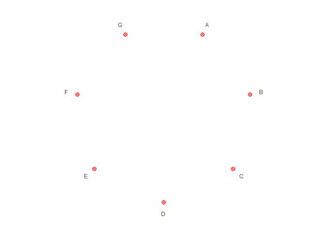
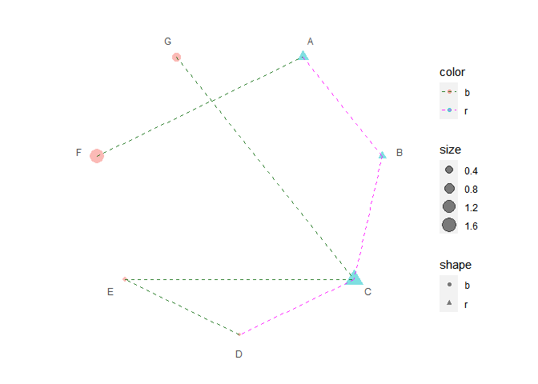

<!-- README.md is generated from README.Rmd. Please edit that file -->

# ggpolar: Dots and Their Connections in Polar Coordinate System

`{ggpolar}` provides a very flexible way to create dots in coordinate
system for event list and connect the dots with segments based on
[`{ggplot2}`](https://ggplot2.tidyverse.org/).

## Installation

You can install the released version of `{ggpolar}` from CRAN with:

``` r
install.packages("ggpolar")
```

You can install the development version of `{ggpolar}` from GitHub with:

``` r
remotes::install_github("ShixiangWang/polar")
```

## Example

### Init a polar plot

``` r
library(ggpolar)
#> 载入需要的程辑包：ggplot2

data <- data.frame(x = LETTERS[1:7])

p1 <- polar_init(data, x = x)
p1
```


``` r
# Set aes value
p2 <- polar_init(data, x = x, size = 3, color = "red", alpha = 0.5)
p2
```



``` r
# Set aes mapping
set.seed(123L)
data1 <- data.frame(
  x = LETTERS[1:7],
  shape = c("r", "r", "r", "b", "b", "b", "b"),
  color = c("r", "r", "r", "b", "b", "b", "b"),
  size = abs(rnorm(7))
)
# Check https://ggplot2.tidyverse.org/reference/geom_point.html
# for how to use both stroke and color
p3 <- polar_init(data1, x = x, aes(size = size, color = color, shape = shape), alpha = 0.5)
p3
```


### Connect polar dots

``` r
data2 <- data.frame(
  x1 = LETTERS[1:7],
  x2 = c("B", "C", "D", "E", "C", "A", "C"),
  color = c("r", "r", "r", "b", "b", "b", "b")
)
p4 <- p3 + polar_connect(data2, x1, x2)
p4
```


``` r
# Unlike polar_init, mappings don't need to be included in aes()
p5 <- p3 + polar_connect(data2, x1, x2, color = color, alpha = 0.8, linetype = 2)
p5
```


``` r
# Use two different color scales
if (requireNamespace("ggnewscale")) {
  library(ggnewscale)
  p6 = p3 +
    new_scale("color") +
    polar_connect(data2, x1, x2, color = color, alpha = 0.8, linetype = 2)
  print(p6 + scale_color_brewer())
  print(p6 + scale_color_manual(values = c("darkgreen", "magenta")))
}
#> 载入需要的名字空间：ggnewscale
```



## Citation

If you use `{ggpolar}` in academic research, please cite the following
paper along with the GitHub repo.

*Antigen presentation and tumor immunogenicity in cancer immunotherapy
response prediction*, **eLife**. <https://doi.org/10.7554/eLife.49020>.
