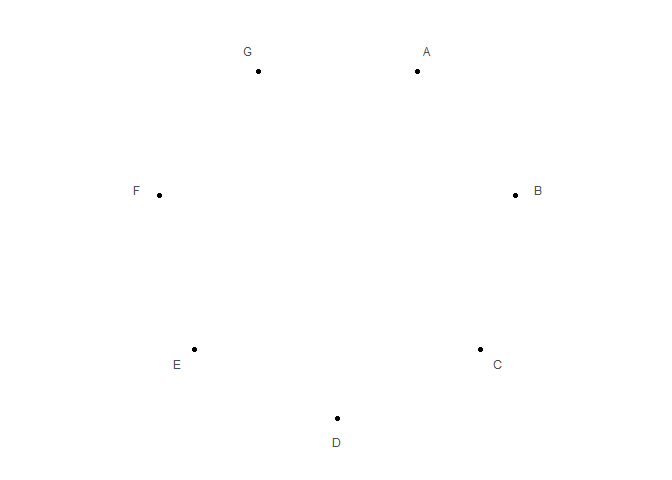
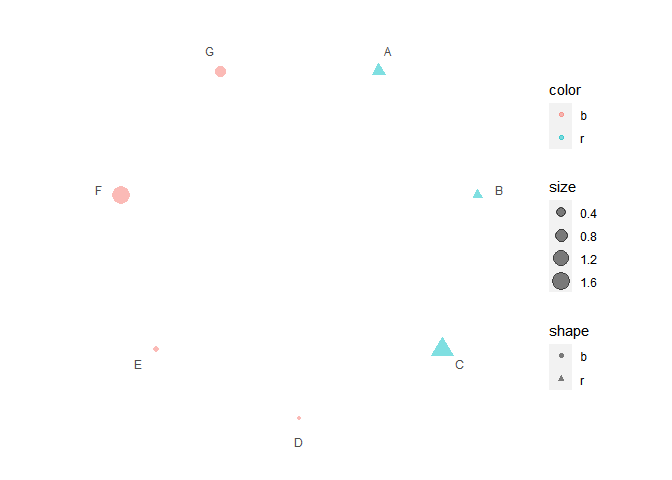

<!-- README.md is generated from README.Rmd. Please edit that file -->

# polar

## Installation

You can install the released version of polar from GitHub with:

``` r
remotes::install_github("ShixiangWang/polar")
```

## Example

This is a basic example which shows you how to solve a common problem:

``` r
library(polar)

data1 = data.frame(
  x = letters[1:7],
  dot_shape = c("r", "r", "r", "b", "b", "b", "b"),
  dot_color = c("r", "r", "r", "b", "b", "b", "b"),
  dot_size = abs(rnorm(7))
)

data2 = data.frame(
  x1 = letters[1:7],
  x2 = c("b", "c", "d", "e", "c", "a", "c"),
  seg_color = c("r", "r", "r", "b", "b", "b", "b")
)

polar(data1, data2)
```



``` r
polar(data1, data2) + ggplot2::scale_color_brewer(palette = 'Reds')
```


``` r
polar(data1, data2) + ggplot2::scale_color_brewer(palette = "YlOrBr")
```


